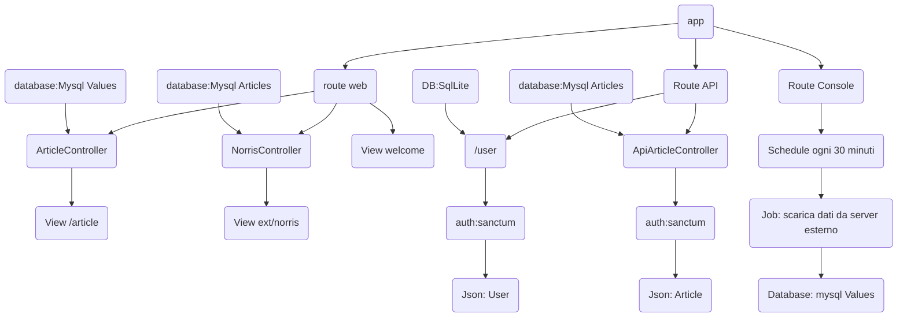

## Descrizione del Progetto di Tirocinio  

### Progetto di Tirocinio alternativo fatto in Iagica per Mobiletti in supermercati

Il progetto usa il framework Laravel 11 PHP 8.2 e MariaDB 10.4 come database, posso gestire prodotti (prelevati/inseriti, nome, quantità, ora (insererimento, uscita)

Inoltre usa due server in contemporanea e interroga un terzo database per avere altri dati in questo caso tramite API ed espone servizi web API usando Oauth2 per la gestione degli articoli, infine con chart.js che visualizza l’andamento degli inserimenti/prelievi dei prodotti per settimana:

MultiBd ha un’area di registrazione / autenticazione dove è possibile modificare le informazioni del proprio account creare un token (Bearer) per l’accesso alle API eventualmente dopo aver configurato il server SMTP (Mail) è possibile l’autenticazione a due fattori.

Tramite l’home page è possibile accedere alla pagina dei grafici, visualizzare i dati acquisiti dal server esterno (una serie di frasi su Chuck Norris) che utilizza una coda di lavoro(Job) e schedulazione(Schedule) di Laravel che mi permette di effettuare la lettura dei dati ogni 30 minuti e nel caso non possa essere completato viene messo in coda.

Infine la pagina degli articoli che è possibile visualizzare e dopo essersi registrati è possibile gestirli.

Per avviare il progetto scaricarlo o clonarlo da GitHub [https://github.com/ManueldG/Laravel-MultiDb.git](https://github.com/ManueldG/Laravel-MultiDb.git) configurare il file .env usare .env.example come base e aggiungere la configurazione al server Mysql/MariaDB

Avviare il server mysql

installare le dipendenze con composer(composer install), npm (npm install)

avviare `php artisan serve` e `npm run dev`

creare una chiave APP_KEY usando il comando `php artisan key:generate`

e far partire `php artisan queue:work` e `php artisan schedule:work`

MultiDB si avvierà all'indirizzo [http://localhost:8000](http://localhost:8000/)

Database Sqlite:

 - Tabelle utenti e gestione token

Database Mysql:

 - Tabella Articoli
 - Tabella Valori

  

Dipendenze Composer:

 - icehouse-ventures/laravel-chartjs: 4.1
   
   laravel/jetstream: 5.2
   
   laravel/sanctum: 4.0
   
   livewire/livewire: 3.0
   
   barryvdh/laravel-debugbar: 3.14
   
   laravel/pint: 1.13
   
   phpunit/phpunit: 11.0.1  

Dipendenze NPM:

 - Axios: 1.7.4
   
   laravel-vite-plugin: 1.0
   
   postcss: 8.4
   
   tailwindcss: 3.4
   
   vite: 5.0
   
   chart.js: 4.4.4 

Api:

 - (GET) localhost:8000/articles: invia un Json con tutti gli elementi
   
 - (GET) localhost:8000/articles/{id}: invia I dati dell’articolo  

 - (POST) localhost:8000/articles: crea un nuovo articolo e gli invio un
   json con i dati necessari

 - (PUT) localhost:8000/articles/{id}: Modifica articolo e gli invio un 
   json con i dati necessari 

 - (DELETE) localhost:8000/articles/{id}: Cancella l'articolo 
  

**Procedimento:**

Per usare i due Database ho dovuto impostare nel file di configurazione (.env) i dati di connessione per Mysql e il path per Sqlite invece in config/database.php creato una seconda connessione chiamata mysql e nei tipi di connessione (connections) ho adattato le chiavi per i valori corrispondenti al file di configurazione .env.

Nel Model Article ho impostato la variabile protected $connection = “mysql”; oppure quando richiamo il modello lo devo istanziare con es.: $article = new Article()->SetConnections(‘mysql) che specifica quale database utitlizzare ho creato un metodo non statico che ho chiamato allI() per reperire tutti i dati della tabella articles.

Jetstream mi è servito per gestire sia l’autenticazione che l’accesso con alle API con Oauth2.0

MultiDB ha un servizio di schedulazione che manda in coda il servizio definito in app/jobs/CallApi.php ogni 30 minuti

Attraverso il Client http di Laravel legge le informazioni da un terzo server tramite una richiesta Json che, in questo caso, scarica frasi su Chuck Norris

da fare:

- il progetto può essere ampliato anche con altri campi e funzionalità ma per ora do precedenza a come usare più database insieme e come acquisire dati da fonti esterne.

-   per usare 2 server in contemporanea dovrei usare il server locale per le modifiche ai prodotti che poi aggiornerò sul server esterno lo ritengo poco funzionale in questo caso
    
-   realizzare dei test con PHPunit i test per gli User sono già implementati mancherebbero quelli sugli articoli.  

### Descrizione delle attività svolte e obiettivi raggiunti  

Questo progetto mi ha permesso di conoscere meglio applicazioni e funzionalità come: Xamp, Vscode, Composer e Node e soprattutto altre funzionalità di Laravel.  

Ho appreso come gestire e configurare più Databases così da scegliere di volta in volta su quale operare in base ai dati gestiti, come funzionano le autenticazioni Oauth2 e in particolare come usarle con le API, cosa sono Queue, Job e gli Schedule in Laravel ho provato a usarli per reperire dati da fonti esterne sono argomenti che andrebbero approfonditi.
Laravel utilizza un sistema di template che è stato migliorato rispetto alle precedenti versioni è sufficiente creare il componente e poi richiamarlo con un tag es. `<x-nomeDelFile/>` mentre con le vecchie versioni si creava un template generale dove venivano sistemati dei placeholder quindi ogni pagina creata estendeva il template generale e andava a riempire i placehoder con i componenti creati inoltre prima usava bootstrap con jquery mentre ora usa tailwind con Vite che lavora con più sistemi come Vue React.

Ho usato importato Chart.js per realizzare i grafici di quanti prodotti ci sono a settimana, Carbon invece l’ho usato per lavorare con le date

Ho installato DebugBar uno strumento utile per vedere il funzionamento di Laravel mi riporta i tempi di caricamento eventuali errori, le viste renderizzate, le rotte disponibili,le query usate per accedere al database,le variabili sessione e variabili server (request) insomma riporta un’instantanea di buona parte del sistema.

Recentemente è stata modificata la struttura dei file kernel.php che era un file centrale utile per far partire processi importanti è stato sostituito da bootstrap/app.php che mi è servito per capire dove posizionare il codice per far partire i Job.

La validazione e gestione degli errori dati è semplice e personalizzabile viene gestita sia lato client che lato PHP.

Conoscevo Laravel già dalla versione 8 mi ero studiato le funzionalità di base come creare dei Model, le migration, i controller e le viste (usando Blade, Vue, React) Laravel 11 non è cambiato molto ma alcune funzionalità avanzate non le conoscevo e quindi sono contento di aver realizzato questo nuovo progetto per migliorare la conoscenza di questo Framework.

  
